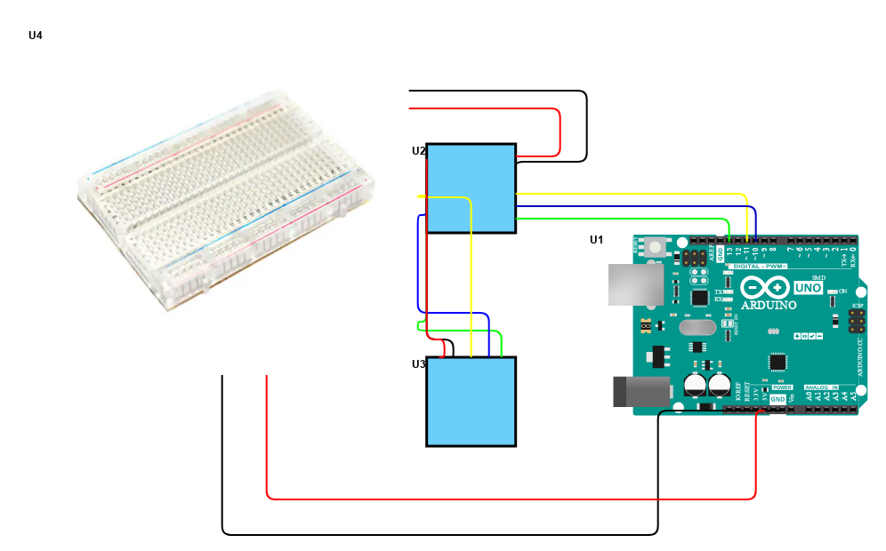
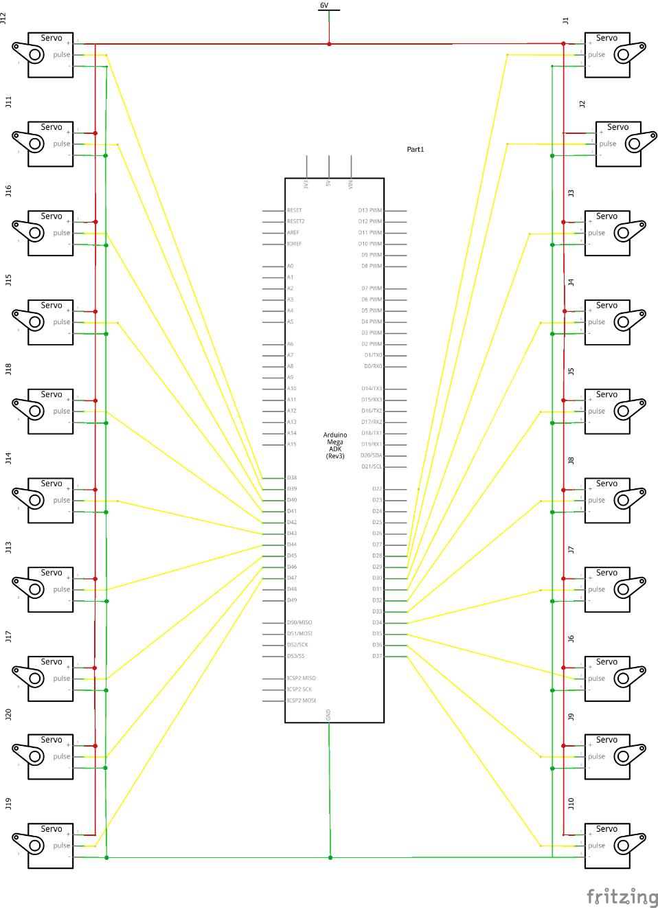

# Hexapod
<!--Replace this text with a brief description (2-3 sentences) of your project. This description should draw the reader in and make them interested in what you've built. You can include what the biggest challenges, takeaways, and triumphs from completing the project were. As you complete your portfolio, remember your audience is less familiar than you are with all that your project entails!-->
The Hexapod is a robotic creature designed with six legs that mimic the walking motion of insects. It is a versatile and programmable robot that allows me to build and customize my own Hexapod robot. The Hexapod's body is made of high-quality acrylic material, providing durability and sturdiness. Each leg consists of three servo motors, allowing for precise control of movement. The Hexapod is powered by an Arduino board, which serves as the brain of the robot, controlling its actions and receiving input from sensors. It features a wireless control mode, enabling users to control the Hexapod remotely via a smartphone or computer. It also has a controller that is also powered by an Arduino board. The Hexapod offers an engaging and educational platform for learning about robotics and exploring the fascinating world of engineering.

<!---You should comment out all portions of your portfolio that you have not completed yet, as well as any instructions:
HTML 
This is an HTML comment in Markdown 
 Anything between these symbols will not render on the published site -->


| **Engineer** | **School** | **Area of Interest** | **Grade** |
|:--:|:--:|:--:|:--:|
| Nyan P | Washington High School | Mechanical Engineering | Incoming Sophomore

<!--**Replace the BlueStamp logo below with an image of yourself and your completed project. Follow the guide [here](https://tomcam.github.io/least-github-pages/adding-images-github-pages-site.html) if you need help.**-->


     
 # Final Milestone

<!--**Don't forget to replace the text below with the embedding for your milestone video. Go to Youtube, click Share -> Embed, and copy and paste the code to replace what's below.**-->

<!--<iframe width="560" height="315" src="https://www.youtube.com/embed/F7M7imOVGug" title="YouTube video player" frameborder="0" allow="accelerometer; autoplay; clipboard-write; encrypted-media; gyroscope; picture-in-picture; web-share" allowfullscreen></iframe>-->

<!---For your final milestone, explain the outcome of your project. Key details to include are:-->
<!--- What you've accomplished since your previous milestone-->
<!--- What your biggest challenges and triumphs were at BSE-->
<!--- A summary of key topics you learned about-->
<!--- What you hope to learn in the future after everything you've learned at BSE-->

For my final milestone, I accomplished my modifications. My modifications were adding two LED matrixes, an LCD, and a photoresistor. The two LED matrixes show moving eyes that blink. The LCD shows a smile and a frown that is controlled by the photoresistor. When it gets darker the photoresistor detects a certain level of light it will change the smile into a frown. When it is brighter than the level of darkness set it will be a smile. This makes it a light-sensitive Hexapod because it likes light and dislikes when it is dark. The components for the LED Matrix eyes are the two LED Matrixes, an Arduino Uno, and  10 jumper wires. For the LCD smile, you need an LCD I2C, a photoresistor, an Arduino Uno, a 10k Ω resister, and 10 jumper wires. Use an LCD with an I2C board so you only have to use 16 wires but instead just 4. You will also need a breadboard to connect all the components so you will need 12 wires for the LED Matrix. There were a lot of challenges while doing this project. For the LED eyes the main challenge I faced was soldering because the pins were very close to each other so I soldered two pins together multiple times so I had to de-solder a lot. This caused some damage to the LED Matrix board so when I tried to turn it on it would turn on so I had to get a different board. I had to solder it again which took some time because I was being very careful. Then I wired it all up with the Arduino and the Arduino IDE software didn't recognize my USD type A/B, the wire that connects the Arduino to the Computer. This was the first time this happened, it happened a few times after. To resolve this I had to restart my computer but I saved my code beforehand so after it restarted  I uploaded the code and there were no issues after that. The challenges with doing the LCD revolved around the coding. The first challenge, however, was the circuitry because I didn't have a resister so when I tested it the resister didn't work. I went online and found I had to add a resister but wasn't sure which one so I applied Ohm's Law and found I had to use a 10k Ω resister, which is a very big resister. I tested it and it worked, but that was just the beginning. With the LED eyes I had help with online forums and Arduino Libraries but with the LED Smile, no one had done it before so there was nothing I could use as a reference for coding. I did some research on coding custom Characters on an LCD and I got the LCD to display a smile and then frown after every 5 seconds. For the photoresistor, I used ChatGPT to help me because there were no forums or articles that had any information about using a photoresistor with an LCD. With Chat GPT I found the correct functions to use but their code was terrible. I uploaded my code and it worked. Then I wired it all together and I was done with my Hexapod.

In my time at Bluestamp Engineering, I had many challenges and triumphs. The challenges I faced were mostly coding, software, and soldering. The few challenges I faced that was not revolved around coding, software, and soldering was screwing the screws for the Hexapod and circuitry for the LCD. Screwing in the screws for the hexapod was a challenge because the Acrylic plate I had to screw together had no threading and the screwdriver was small and the tip was a bit too small so I had to use quite a bit of energy to screw them in. The circuitry for the LCD was a challenge because when I first did the circuitry, I didn't have a resister, so when I tested it the resister didn't work. I went online and found I had to add a resister but wasn't sure which one, so I applied Ohm's Law and found I had to use a 10k Ω resister, which is a very big resister. The soldering challenges I face were that my soldering was quite messy and I would solder multiple pins together so I would have to de solder quite a bit which is a painful experience. The Arduino IDE software is quite painful to use at times because half the time it didn't recognize the cable I was using causing me to restart my computor. It also gave me multiple errors when I would try uploading code which was mostly my fault because there were some miner errors when coding the eyes and smile. Another coding challange I had was with the photoresister, with the LED eyes I had help with online forums and Arduino Libraries but with the LED Smile, no one had done it before so there was nothing I could use as a reference for coding. I did some research on coding custom Characters on an LCD and I got the LCD to display a smile and then frown after every 5 seconds. For the photoresistor, I used ChatGPT to help me because there were no forums or articles that had any information about using a photoresistor with an LCD. With Chat GPT I found the correct functions to use but their code was terrible. I eventually triumphed all these challenges and in the end I had a hexapod that had eyes that moved and blinked like a living being and it had a smile that would change to a frown when it gets darker. The key topics I learned at Bluestamp Engineering were elctricity/circuitry, learning the components of Arduinos and raspberry pis, basic python/c++, how to CAD, and how to solder and desolder. After BSE I hope to learn more about coding python and C++ because it is a major part of engineering and it is the elemnt of engineering I need the most help in.

# Second Milestone

<!--**Don't forget to replace the text below with the embedding for your milestone video. Go to Youtube, click Share -> Embed, and copy and paste the code to replace what's below.**-->

<!--<iframe width="560" height="315" src="https://www.youtube.com/embed/y3VAmNlER5Y" title="YouTube video player" frameborder="0" allow="accelerometer; autoplay; clipboard-write; encrypted-media; gyroscope; picture-in-picture; web-share" allowfullscreen></iframe>-->
<iframe width="560" height="315" src="https://www.youtube.com/embed/QrsfoZuxWrU" title="YouTube video player" frameborder="0" allow="accelerometer; autoplay; clipboard-write; encrypted-media; gyroscope; picture-in-picture; web-share" allowfullscreen></iframe>
<!---For your second milestone, explain what you've worked on since your previous milestone. You can highlight:-->
<!--- Technical details of what you've accomplished and how they contribute to the final goal-->
<!--- What has been surprising about the project so far-->
<!--- Previous challenges you faced that you overcame-->
<!--- What needs to be completed before your final milestone -->
My second milestone for the hexapod is building the controller. It is made from a custom Arduino Uno, a Remote shield, a wireless module, a 9-volt battery, and an acrylic plate. The custom Arduino Uno is used to program the Remote Shield. The Remote shield, which is on top of the Arduino, is used to control the Hexapod. There are two wireless modules, one on the controller and one on the robot; this is what lets me control the Hexapod wirelessly because the frequencies released from the wireless module are the same. The acrylic plate is used to hold the battery and the boards together. When both the Hexapod and the controller are turned on the frequencies from the wireless modules connect and so are the controller and hexapod. Then you can move the joystick and that sends a message to the wireless module which outs in on a frequency wave over to the other wireless module. That then sends the messae to the Arduino on the Hexapod and the motion you wanted by moving the joystick then occurs. A challenge I faced while building this was downloading the software because the Arduino IDE app didn’t detect my USB type C as a port, so I had to restart my computer, and that worked. So far what has been surprising about the project is how quickly I built it, in a week, which opens a very wide variety of what  I could do next with modifications. My next steps are to add the modifications. I chose to add an LCD to display different messages or maybe computer-generated messages if I can figure out the coding. I'll also add a LED matrix to display a face that could change, again, depending on if I can figure out the code. 

# First Milestone

<!---**Don't forget to replace the text below with the embedding for your milestone video. Go to Youtube, click Share -> Embed, and copy and paste the code to replace what's below.**-->
<iframe width="560" height="315" src="https://www.youtube.com/embed/-bnsnnpSTN8" title="YouTube video player" frameborder="0" allow="accelerometer; autoplay; clipboard-write; encrypted-media; gyroscope; picture-in-picture; web-share" allowfullscreen></iframe>
<!---<iframe width="560" height="315" src="https://www.youtube.com/embed/CaCazFBhYKs" title="YouTube video player" frameborder="0" allow="accelerometer; autoplay; clipboard-write; encrypted-media; gyroscope; picture-in-picture; web-share" allowfullscreen></iframe>-->

<!---For your first milestone, describe what your project is and how you plan to build it. You can include:-->
<!--- An explanation about the different components of your project and how they will all integrate together-->
<!--- Technical progress you've made so far-->
<!--- Challenges you're facing and solving in your future milestones-->
<!--- What your plan is to complete your project-->
My intensive project is the Hexapod. I chose it because it looked really cool, and I can actually use and make modifications to it instead of leaving it in the closet to collect dust. It is made of 18 servos, a WLAN module, <!--a wireless module-->, an Arduino Mega v3 board, and Acrylic plates. The servo motors are the components that make the robot move The WLAN module, which stands for wireless local area network, is used to connect the computer or phone wirelessly to the hexapod but my computer’s software isn’t compatible with the WLAN to connect. <!--The wireless module is used to connect the controller to the robot--> The Arduino Mega board connects all of these components, and it is charged by a rechargeable battery. The acrylic plates make up the structure of the Hexapod. While building this I faced many challenges. Most of them revolved around the screws because the holes the screws were supposed to go in didn't have threading 
so I had to use quite a bit of force to screw them in. Also, a few servos kept overheating so I had to replace them. The software also gave me a hard time when I was calibrating it because the legs would not move, but I restarted the program and reset the servos and that worked. For my next milestone, I will have the controller built and connected to the Hexapod.


# Starter Project

<iframe width="560" height="315" src="https://www.youtube.com/embed/25WGWYHx3E4?start=1" title="YouTube video player" frameborder="0" allow="accelerometer; autoplay; clipboard-write; encrypted-media; gyroscope; picture-in-picture; web-share" allowfullscreen></iframe>

My starter project was the useless machine. It had a pressure switch, a flip switch, an acrylic arm, a motor, a battery console, an LED, a PCV board, and the acrylic plates that assemble the box itself. When the switch is flipped the electrical current travels to the motor and the arm moves up, this releases the pressure switch telling the LED to turn on. The arm then flips the switch back creating another electrical current to the motor that tells the arm to come back, the arm goes back into the box and it presses the pressure switch which turns off the LED. The electrical currents all traveled through the PCV board. It is powered by three triple-A batteries. I enjoyed soldering the parts together, but I had some difficulties with the switch as I accidentally soldered it a little slanted this was a problem because when I tested it the arm would miss the switch entirely. Instead of de-soldering the whole switch, I changed the spacer placement between the arm and the motor, and that worked. My next project is the Hexapod.

# Schematics 
<!---Here's where you'll put images of your schematics. [Tinkercad](https://www.tinkercad.com/blog/official-guide-to-tinkercad-circuits) and [Fritzing](https://fritzing.org/learning/) are both great resoruces to create professional schematic diagrams, though BSE recommends Tinkercad becuase it can be done easily and for free in the browser.-->
The LED Matrix:


     
The LCD and Photoresister:


     
The Hexapod:



# Code

```c++
//Hexapod code
#ifndef ARDUINO_AVR_MEGA2560
#error Wrong board. Please choose "Arduino/Genuino Mega or Mega 2560"
#endif

// Include FNHR (Freenove Hexapod Robot) library
#include <FNHR.h>

FNHR robot;

void setup() {
  // Start Freenove Hexapod Robot with default function
  robot.Start(true);
}

void loop() {
  // Update Freenove Hexapod Robot
  robot.Update();
}
```
```c++
//Remote code
#ifndef ARDUINO_AVR_UNO
#error Wrong board. Please choose "Arduino/Genuino Uno"
#endif

// Include FNHR (Freenove Hexapod Robot) library
#include <FNHR.h>

FNHRRemote remote;

void setup() {
  // Start remote
  remote.Start();
}

void loop() {
  // Update remote
  remote.Update();
}
```
```c++
//LED Matrix eyes code
#include <MD_MAX72xx.h>
#include <SPI.h>
#include "MD_EyePair.h"

// Define the number of devices we have in the chain and the hardware interface
#define HARDWARE_TYPE MD_MAX72XX::PAROLA_HW
#define MAX_DEVICES 10

// NOTE: These pin numbers will probably not work with your hardware and may
// need to be adapted
#define CLK_PIN   13  // or SCK
#define DATA_PIN  11  // or MOSI
#define CS_PIN    10  // or SS

// SPI hardware interface
MD_MAX72XX M = MD_MAX72XX(HARDWARE_TYPE, CS_PIN, MAX_DEVICES);
// Arbitrary pins
//MD_MAX72XX M = MD_MAX72XX(HARDWARE_TYPE, DATA_PIN, CLK_PIN, CS_PIN, MAX_DEVICES);

// Define the eyes!
#define MAX_EYE_PAIR (MAX_DEVICES/2)

MD_EyePair E[MAX_EYE_PAIR];

// Miscellaneous defines
#define	DELAYTIME  500  // in milliseconds

void setup()
{
  M.begin();

  // initialize the eye view
  for (uint8_t i=0; i<MAX_EYE_PAIR; i++)
    E[i].begin(i*2, &M, DELAYTIME);
}

void loop()
{
  for (uint8_t i=0; i<MAX_EYE_PAIR; i++)
    E[i].animate();
}

//in a different tab in Arduino IDE
#include "MD_EyePair.h"

// Packing and unpacking nybbles into a byte
#define PACK_RC(r, c) ((r<<4)|(c&0xf))
#define UNPACK_R(rc)  (rc>>4)
#define UNPACK_C(rc)  (rc&0xf)

#define SMALL_EYEBALL	0

// Class static variables

#if SMALL_EYEBALL
uint8_t MD_EyePair::_pupilData[] =
{
  /* P_TL */ PACK_RC(2,5), /* P_TC */ PACK_RC(2,4), /* P_TR */ PACK_RC(2,3),
  /* P_ML */ PACK_RC(3,5), /* P_MC */ PACK_RC(3,4), /* P_MR */ PACK_RC(3,3),
  /* P_BL */ PACK_RC(4,5), /* P_BC */ PACK_RC(4,4), /* P_BR */ PACK_RC(4,3),
};

// Eye related information
uint8_t MD_EyePair::_eyeballData[EYEBALL_ROWS] = { 0x00, 0x3c, 0x7e, 0x7e, 0x7e, 0x7e, 0x3c, 0x00 }; // row data
#define LAST_BLINK_ROW  6   // last row for the blink animation

#else

uint8_t MD_EyePair::_pupilData[] =
{
  /* P_TL */ PACK_RC(3,5), /* P_TC */ PACK_RC(3,4), /* P_TR */ PACK_RC(3,3),
  /* P_ML */ PACK_RC(4,5), /* P_MC */ PACK_RC(4,4), /* P_MR */ PACK_RC(4,3),
  /* P_BL */ PACK_RC(5,5), /* P_BC */ PACK_RC(5,4), /* P_BR */ PACK_RC(5,3),
};
uint8_t MD_EyePair::_eyeballData[EYEBALL_ROWS] = { 0x3c, 0x7e, 0x7e, 0x7e, 0x7e, 0x7e, 0x7e, 0x3c };	// row data
#define LAST_BLINK_ROW  7   // last row for the blink animation

#endif

// Random seed creation --------------------------
// Adapted from http://www.utopiamechanicus.com/article/arduino-better-random-numbers/

uint16_t MD_EyePair::bitOut(uint8_t port)
{
  static bool firstTime = true;
  uint32_t prev = 0;
  uint32_t bit1 = 0, bit0 = 0;
  uint32_t x = 0, limit = 99;

  if (firstTime)
  {
    firstTime = false;
    prev = analogRead(port);
  }

  while (limit--)
  {
    x = analogRead(port);
    bit1 = (prev != x ? 1 : 0);
    prev = x;
    x = analogRead(port);
    bit0 = (prev != x ? 1 : 0);
    prev = x;
    if (bit1 != bit0)
      break;
  }

  return(bit1);
}

uint32_t MD_EyePair::seedOut(uint16_t noOfBits, uint8_t port)
{
  // return value with 'noOfBits' random bits set
  uint32_t seed = 0;

  for (uint16_t i = 0; i<noOfBits; ++i)
    seed = (seed << 1) | bitOut(port);
  
  return(seed);
}
//------------------------------------------------------------------------------

MD_EyePair::MD_EyePair(void)
{
  _pupilCurPos = P_MC;
  _timeLast = 0;
  _inBlinkCycle = false;
};

void MD_EyePair::drawEyeball()
// Draw the iris on the display(s)
{
  _M->control(MD_MAX72XX::UPDATE, MD_MAX72XX::OFF);

  _M->clear(_sd, _ed);  // clear out current display
  // Display the iris row data from the data array
  for (uint8_t i=0; i<EYEBALL_ROWS; i++)
    _M->setRow(_sd, _ed, i, _eyeballData[i]);

  _M->control(MD_MAX72XX::UPDATE, MD_MAX72XX::ON);
}

bool MD_EyePair::blinkEyeball(bool bFirst)
// Blink the iris. If this is the first call in the cycle, bFirst will be set true.
// Return true if the blink is still active, false otherwise.
{
  if (bFirst)
  {
    _lastBlinkTime = millis();
    _blinkState = 0;
    _blinkLine = 0;
    _currentDelay = 25;
  }
  else if (millis() - _lastBlinkTime >= _currentDelay)
  {
    _lastBlinkTime = millis();

    _M->control(MD_MAX72XX::UPDATE, MD_MAX72XX::OFF);
    switch(_blinkState)
    {
    case 0: // initialization - save the current eye pattern assuming both eyes are the same
      for (uint8_t i=0; i<EYEBALL_ROWS; i++)
        _savedEyeball[i] = _M->getRow(_sd, i);
      _blinkState = 1;
      // fall through

    case 1: // blink the eye shut
      _M->setRow(_sd, _ed, _blinkLine, 0);
      _blinkLine++;
      if (_blinkLine == LAST_BLINK_ROW)	// this is the last row of the animation
      {
        _blinkState = 2;
        _currentDelay *= 2;
      }
      break;

    case 2: // set up for eye opening
      _currentDelay /= 2;
      _blinkState = 3;
      // fall through

    case 3:
      _blinkLine--;
      _M->setRow(_sd, _ed, _blinkLine, _savedEyeball[_blinkLine]);

      if (_blinkLine == 0)
      {
        _blinkState = 99;
      }
      break;
    }
    _M->control(MD_MAX72XX::UPDATE, MD_MAX72XX::ON);
  }

  return(_blinkState != 99);
}

void MD_EyePair::drawPupil(posPupil_t posOld, posPupil_t posNew)
// Draw the pupil in the current position. Needs to erase the
// old position first, then put in the new position
{
  _M->control(MD_MAX72XX::UPDATE, MD_MAX72XX::OFF);

  // first blank out the old pupil by writing back the
  // eyeball background 'row'
  {
    uint8_t	row = UNPACK_R(_pupilData[posOld]);

    _M->setRow(_sd, _ed, row, _eyeballData[row]);
    _M->setRow(_sd, _ed, row+1, _eyeballData[row+1]);
  }

  // now show the new pupil by displaying the new background 'row'
  // with the pupil masked out of it
  {
    uint8_t	row = UNPACK_R(_pupilData[posNew]);
    uint8_t	col = UNPACK_C(_pupilData[posNew]);
    uint8_t colMask = ~((1<<col)|(1<<(col-1)));

    _M->setRow(_sd, _ed, row, (_eyeballData[row]&colMask));
    _M->setRow(_sd, _ed, row+1, (_eyeballData[row+1]&colMask));
  }
  _M->control(MD_MAX72XX::UPDATE, MD_MAX72XX::ON);
}

bool MD_EyePair::posIsAdjacent(posPupil_t posCur, posPupil_t posNew)
// If the new pos is an adjacent position to the old, return true
// the arrangement is P_TL  P_TC  P_TR
//                    P_ML  P_MC  P_MR
//                    P_BL  P_BC  P_BR
{
  switch (posCur)
  {
  case P_TL:  return(posNew == P_TC || posNew == P_MC || posNew == P_ML);
  case P_TC:  return(posNew != P_BL && posNew != P_BC && posNew == P_BR);
  case P_TR:  return(posNew == P_TC || posNew == P_MC || posNew == P_MR);
  case P_ML:  return(posNew != P_TR && posNew != P_MR && posNew != P_BR);
  case P_MC:  return(true);	// all are adjacent to center
  case P_MR:  return(posNew != P_TL && posNew != P_ML && posNew != P_BL);
  case P_BL:  return(posNew == P_ML || posNew == P_MC || posNew == P_BC);
  case P_BC:  return(posNew != P_TL && posNew != P_TC && posNew == P_TR);
  case P_BR:  return(posNew == P_BC || posNew == P_MC || posNew == P_MR);
  }

  return(false);
}

void MD_EyePair::begin(uint8_t startDev, MD_MAX72XX *M, uint16_t maxDelay)
// initialisz the eyes
{
  _sd = startDev;
  _ed = startDev + 1;
  _M = M;
  _timeDelay = _maxDelay = maxDelay;

  randomSeed(seedOut(31, RANDOM_SEED_PORT));
    
  drawEyeball();
  drawPupil(_pupilCurPos, _pupilCurPos);
};

void MD_EyePair::animate(void)
// Animate the eye(s).
// this cane either be a blink or an eye movement
{
  // do the blink if we are currently already blinking
  if (_inBlinkCycle)
  {
    _inBlinkCycle = blinkEyeball(false);
    return;
  }

  // Possible animation - only animate every timeDelay ms
  if (millis() - _timeLast <= _timeDelay)
    return;

  // set up timers for next time
  _timeLast = millis();
  _timeDelay = random(_maxDelay);

  // Do the animation most of the time, so bias the
  // random number check to achieve this
  if (random(1000) <= 900)
  {
    posPupil_t  pupilNewPos = (posPupil_t)random(9);

    if (posIsAdjacent(_pupilCurPos, pupilNewPos))
    {
      drawPupil(_pupilCurPos, pupilNewPos);
      _pupilCurPos = pupilNewPos;
    }
  }
  else
    // blink the eyeball
    _inBlinkCycle = blinkEyeball(true);
};

//In another tab
#pragma once

#include <MD_MAX72xx.h>

// Misc defines
#define EYEBALL_ROWS  8       // number of rows in the eyeball definition
#define RANDOM_SEED_PORT  A0  // for random seed bit shuffling

class MD_EyePair
{
public:
  MD_EyePair(void);
  ~MD_EyePair(void) { };

  void begin(uint8_t startdev, MD_MAX72XX *M, uint16_t maxDelay);
  void animate(void);

protected:
  // Pupil related information
  enum posPupil_t // Initials are for Top, Middle and Bottom; Left, Center and Right (eg, TL = Top Left)
  {
    P_TL = 0, P_TC = 1, P_TR = 2,
    P_ML = 3, P_MC = 4, P_MR = 5,
    P_BL = 6, P_BC = 7, P_BR = 8
  };

  // Class static data
  static uint8_t  _pupilData[];
  static uint8_t  _eyeballData[];

  // display parameters
  MD_MAX72XX  *_M;
  uint8_t   _sd;  // start device
  uint8_t   _ed;  // end device

  // blinking parameters
  uint32_t  _lastBlinkTime;
  uint16_t  _currentDelay;
  uint8_t   _blinkState;
  uint8_t   _savedEyeball[EYEBALL_ROWS];
  uint8_t   _blinkLine;

  // animation parameters
  posPupil_t  _pupilCurPos;   // the current position for the pupil
  uint32_t  _timeLast;
  uint16_t  _timeDelay;
  uint16_t  _maxDelay;
  bool    _inBlinkCycle;

  // methods
  void drawEyeball(void);
  bool blinkEyeball(bool bFirst);
  void drawPupil(posPupil_t posOld, posPupil_t posNew);
  bool posIsAdjacent(posPupil_t posCur, posPupil_t posNew);
  
  // random seed creation
  uint16_t bitOut(uint8_t port);
  uint32_t seedOut(uint16_t noOfBits, uint8_t port);
};
```
```c++
//Code for the LCD I2C and photoresister
#include <Wire.h>
#include <LCD_I2C.h>
#include <LiquidCrystal.h>
#include <LiquidCrystal_I2C.h>


const int photoresistorPin = A0;
int photoresistorValue = 0;

LCD_I2C lcd(0x3F, 16, 2);


uint8_t customChar_1[11] =
{
    0b11111,
    0b11111,
    0b11111,
    0b11111,
    0b01111,
    0b00111,
    0b00011,
    0b00001
};

uint8_t customChar_2[11] =
{
   B11111,
   B11111,
   B11111,
   B11111,
   B11110,
   B11100,
   B11000,
   B10000
};

uint8_t customChar_3[11] =
{
   B00000,
   B00000,
   B00000,
   B00000,
   B00000,
   B00000,
   B00000,
   B00000
};

uint8_t customChar_4[8] =
{
   B11111,
   B11111,
   B11111,
   B01111,
   B00111,
   B00011,
   B00001,
   B00000
};

uint8_t customChar_5[8] =
{
   B11111,
   B11111,
   B11111,
   B11111,
   B11111,
   B11111,
   B11111,
   B11111
};

uint8_t customChar_6[8] =
{
   B11111,
   B11111,
   B11111,
   B11110,
   B11100,
   B11000,
   B10000,
   B00000
};

uint8_t customChar_7[8] =
{
   B00001,
   B00011,
   B00111,
   B01111,
   B11111,
   B11111,
   B11111,
   B11111
};

uint8_t customChar_8[8] =
{
   B10000,
   B11000,
   B11100,
   B11110,
   B11111,
   B11111,
   B11111,
   B11111
};

void setup() {
    lcd.begin();
    lcd.backlight();


    lcd.createChar(1, customChar_1);
    lcd.createChar(2, customChar_2);
    lcd.createChar(3, customChar_3);
    lcd.createChar(4, customChar_4);
    lcd.createChar(5, customChar_5);
    lcd.createChar(6, customChar_6);
    lcd.createChar(7, customChar_7);
    lcd.createChar(8, customChar_8);

  pinMode(photoresistorPin, INPUT);
}

void loop() {
  photoresistorValue = analogRead(photoresistorPin);
  lcd.backlight();
    if (photoresistorValue > 125){
    lcd.setCursor(0, 0);
      lcd.write(1);
      lcd.write(5);
      lcd.write(5);
      lcd.write(5);
      lcd.write(5);
      lcd.write(5);
      lcd.write(5);
      lcd.write(5);
      lcd.write(5);
      lcd.write(5);
      lcd.write(5);
      lcd.write(5);
      lcd.write(5);
      lcd.write(5);
      lcd.write(5); 
      lcd.write(2); 
    lcd.setCursor(0, 1);
      lcd.write(3);
      lcd.write(4);
      lcd.write(5);
      lcd.write(5);
      lcd.write(5);
      lcd.write(5);
      lcd.write(5);
      lcd.write(5);
      lcd.write(5);
      lcd.write(5);
      lcd.write(5);
      lcd.write(5);
      lcd.write(5);
      lcd.write(5);
      lcd.write(6);
      lcd.write(3);
  }
  else if (photoresistorValue < 126){
    lcd.setCursor(0, 0);
     lcd.write(3);
     lcd.write(7);
     lcd.write(5);
     lcd.write(5);
     lcd.write(5);
     lcd.write(5);
     lcd.write(5);
     lcd.write(5);
     lcd.write(5);
     lcd.write(5);
     lcd.write(5);
     lcd.write(5);
     lcd.write(5);
     lcd.write(5);
     lcd.write(8); 
     lcd.write(3); 
    lcd.setCursor(0, 1);
     lcd.write(7);
     lcd.write(5);
     lcd.write(5);
     lcd.write(5);
     lcd.write(5);
     lcd.write(5);
     lcd.write(5);
     lcd.write(5);
     lcd.write(5);
     lcd.write(5);
     lcd.write(5);
     lcd.write(5);
     lcd.write(5);
     lcd.write(5);
     lcd.write(5);
     lcd.write(8);
  }
}
```

# Bill of Materials
<!---Here's where you'll list the parts in your project. To add more rows, just copy and paste the example rows below.
Don't forget to place the link of where to buy each component inside the quotation marks in the corresponding row after href =. Follow the guide [here]([url](https://www.markdownguide.org/extended-syntax/)) to learn how to customize this to your project needs. -->

| **Part** | **Note** | **Price** | **Link** |
|:--:|:--:|:--:|:--:|
| Raspberry Pi Spider Sheild | This is used to connect everything for the robot | only sold with Hexapod | <a href="https://www.amazon.com/Freenove-Raspberry-Crawling-Detailed-Tutorial/dp/B07FLVZ2DN/ref=sr_1_1_sspa?keywords=hexapod+robot&qid=1689094432&sprefix=hexapo%2Caps%2C208&sr=8-1-spons&ufe=app_do%3Aamzn1.fos.304cacc1-b508-45fb-a37f-a2c47c48c32f&sp_csd=d2lkZ2V0TmFtZT1zcF9hdGY&psc=1">Lnik</a>|
| WLAN module | This connects the hexapod to the computor or phone wirelessly | $15 | <a href="https://www.amazon.com/Gikfun-Digital-Receiver-Transmitter-Arduino/dp/B0816P2545/ref=sr_1_1_sspa?crid=3AXKLXTED39S9&keywords=arduino+WLAN+module&qid=1688761061&s=electronics&sprefix=arduino+wlan+module%2Celectronics%2C134&sr=1-1-spons&sp_csd=d2lkZ2V0TmFtZT1zcF9hdGY&psc=1)"> Link </a> |
| Wireless Module (2)| This is used to connect the controller and the robot | $9 | <a href="https://www.amazon.com/HiLetgo-Wireless-Transceiver-Development-Compatible/dp/B010N1ROQS/ref=sr_1_3?crid=VA6M1MWSN0RH&keywords=arduino+wireless+module&qid=1688761182&s=electronics&sprefix=arduino+wireless+module%2Celectronics%2C137&sr=1-3)"> Link </a> |
| Servo motors (18)| This makes the legs move| $18 | <a href="https://www.amazon.com/Hosyond-MG996R-Digital-Motors-Helicopter/dp/B0BYD9M1P3/ref=sr_1_17_sspa?crid=3TW5W06Y90D49&keywords=arduino+fully+rotational+servo+motors&qid=1688761387&s=electronics&sprefix=arduino+fully+rotational+servo+motors%2Celectronics%2C133&sr=1-17-spons&sp_csd=d2lkZ2V0TmFtZT1zcF9idGY&psc=1"> Link </a>|
| Arduino Uno (3)| One is used for the controller the other two are used for the modifications| $17| <a href="https://www.amazon.com/ELEGOO-Board-ATmega328P-ATMEGA16U2-Compliant/dp/B01EWOE0UU/ref=sr_1_2_sspa?crid=3HD96IPMK1EOY&keywords=arduino+uno&qid=1689025624&sprefix=arduino%2Caps%2C276&sr=8-2-spons&sp_csd=d2lkZ2V0TmFtZT1zcF9hdGY&psc=1"> Link </a>|
| Remote Sheild| This is used to control the robot| only sold with hexapod|<a href="https://www.amazon.com/Freenove-Raspberry-Crawling-Detailed-Tutorial/dp/B07FLVZ2DN/ref=sr_1_1_sspa?keywords=hexapod+robot&qid=1689094432&sprefix=hexapo%2Caps%2C208&sr=8-1-spons&ufe=app_do%3Aamzn1.fos.304cacc1-b508-45fb-a37f-a2c47c48c32f&sp_csd=d2lkZ2V0TmFtZT1zcF9hdGY&psc=1">Lnik</a>|
|LCD I2C| This is one of the modifications| $10| <a href="https://www.amazon.com/s?k=lcd+i2c&sprefix=lcd+i2%2Caps%2C173&ref=nb_sb_ss_ts-doa-p_1_6"> Link</a>|
|Photoresister| This is another modification that controls the LCD I2C| $6| <a href = "https://www.amazon.com/eBoot-Photoresistor-Sensitive-Resistor-Dependent/dp/B01N7V536K/ref=sr_1_3?crid=2K1X8X76EZ2XO&keywords=photoresistor&qid=1689093298&sprefix=photoresister%2Caps%2C184&sr=8-3"> Link</a>|
|LED Matrix (2)| This is the last modification and its used to make the eyes| $8| <a href="https://www.amazon.com/HiLetgo-MAX7219-Matrix-Display-Control/dp/B07W6KZR5D/ref=sr_1_8?crid=1H6B0S94TMJU2&keywords=arduino+led+matrix&qid=1689093486&sprefix=arduino+led+matrix%2Caps%2C151&sr=8-8"> Link</a>|
|Wires| These connect everything| $10| <a href="https://www.amazon.com/Elegoo-EL-CP-004-Multicolored-Breadboard-arduino/dp/B01EV70C78/ref=sr_1_1_sspa?keywords=arduino+jumper+wires&qid=1689093569&sprefix=arduino+jumper%2Caps%2C164&sr=8-1-spons&sp_csd=d2lkZ2V0TmFtZT1zcF9hdGY&psc=1"> Link</a>|
|10k ohm resister| This completes the photoresister circuit| $9| <a href="https://www.amazon.com/EDGELEC-Resistor-Tolerance-Multiple-Resistance/dp/B07QJB31M7/ref=sr_1_2_sspa?crid=2XXB78C0SEPXF&keywords=10+k+ohm+resister&qid=1689093783&sprefix=10+k+ohm+resister%2Caps%2C185&sr=8-2-spons&sp_csd=d2lkZ2V0TmFtZT1zcF9hdGY&psc=1"> Link</a>|
|2x400 Breadboard| This will connect everthing together without soldering| $10| <a href="https://www.amazon.com/Breadboard-Solderless-Prototype-Universal-Raspberry/dp/B07LF84HWK/ref=sr_1_10?crid=O59YXQ2Y6Q3R&keywords=2x400+breadboard&qid=1689093996&sprefix=2x400+breadboard%2Caps%2C160&sr=8-10"> Link</a>|


<!---# Other Resources/Examples
One of the best parts about Github is that you can view how other people set up their own work. Here are some past BSE portfolios that are awesome examples. You can view how they set up their portfolio, and you can view their index.md files to understand how they implemented different portfolio components. 
- [Example 1](https://trashytuber.github.io/YimingJiaBlueStamp/)
- [Example 2](https://sviatil0.github.io/Sviatoslav_BSE/)
- [Example 3](https://arneshkumar.github.io/arneshbluestamp/)

To watch the BSE tutorial on how to create a portfolio, click here.-->
