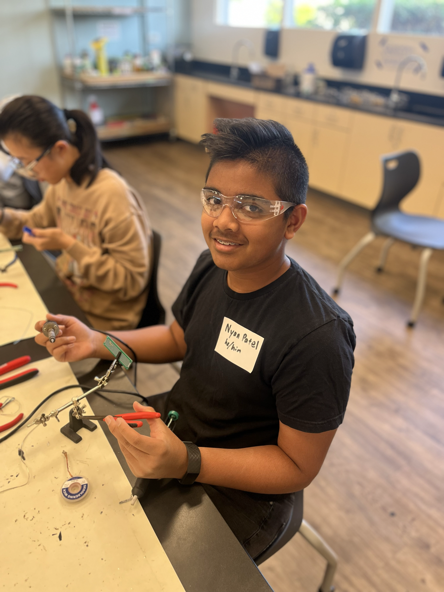

# Hexapod
<!--Replace this text with a brief description (2-3 sentences) of your project. This description should draw the reader in and make them interested in what you've built. You can include what the biggest challenges, takeaways, and triumphs from completing the project were. As you complete your portfolio, remember your audience is less familiar than you are with all that your project entails!-->
The Hexapod is a robotic creature designed with six legs that mimic the walking motion of insects. It is a versatile and programmable robot that allows me to build and customize my own Hexapod robot. The Hexapod's body is made of high-quality acrylic material, providing durability and sturdiness. Each leg consists of three servo motors, allowing for precise control of movement. The Hexapod is powered by an Arduino board, which serves as the brain of the robot, controlling its actions and receiving input from sensors. It features a wireless control mode, enabling users to control the Hexapod remotely via a smartphone or computer. It also has a controller that is also powered by an Arduino board. The Hexapod offers an engaging and educational platform for learning about robotics and exploring the fascinating world of engineering.

<!---You should comment out all portions of your portfolio that you have not completed yet, as well as any instructions:
HTML 
This is an HTML comment in Markdown 
 Anything between these symbols will not render on the published site -->


| **Engineer** | **School** | **Area of Interest** | **Grade** |
|:--:|:--:|:--:|:--:|
| Nyan P | Washington High School | Mechanical Engineering | Incoming Sophomore

<!--**Replace the BlueStamp logo below with an image of yourself and your completed project. Follow the guide [here](https://tomcam.github.io/least-github-pages/adding-images-github-pages-site.html) if you need help.**-->


<!--# Final Milestone-->

<!--**Don't forget to replace the text below with the embedding for your milestone video. Go to Youtube, click Share -> Embed, and copy and paste the code to replace what's below.**-->

<!--<iframe width="560" height="315" src="https://www.youtube.com/embed/F7M7imOVGug" title="YouTube video player" frameborder="0" allow="accelerometer; autoplay; clipboard-write; encrypted-media; gyroscope; picture-in-picture; web-share" allowfullscreen></iframe>-->

<!---For your final milestone, explain the outcome of your project. Key details to include are:-->
<!--- What you've accomplished since your previous milestone-->
<!--- What your biggest challenges and triumphs were at BSE-->
<!--- A summary of key topics you learned about-->
<!--- What you hope to learn in the future after everything you've learned at BSE-->


# Second Milestone

<!--**Don't forget to replace the text below with the embedding for your milestone video. Go to Youtube, click Share -> Embed, and copy and paste the code to replace what's below.**-->

<!--<iframe width="560" height="315" src="https://www.youtube.com/embed/y3VAmNlER5Y" title="YouTube video player" frameborder="0" allow="accelerometer; autoplay; clipboard-write; encrypted-media; gyroscope; picture-in-picture; web-share" allowfullscreen></iframe>-->
<iframe width="560" height="315" src="https://www.youtube.com/embed/QrsfoZuxWrU" title="YouTube video player" frameborder="0" allow="accelerometer; autoplay; clipboard-write; encrypted-media; gyroscope; picture-in-picture; web-share" allowfullscreen></iframe>
<!---For your second milestone, explain what you've worked on since your previous milestone. You can highlight:-->
<!--- Technical details of what you've accomplished and how they contribute to the final goal-->
<!--- What has been surprising about the project so far-->
<!--- Previous challenges you faced that you overcame-->
<!--- What needs to be completed before your final milestone -->
My second milestone for the hexapod is building the controller. It is made from a custom Arduino Uno, a Remote shield, a wireless module, a 9-volt battery, and an acrylic plate. The custom Arduino Uno is used to program the Remote Shield. The Remote shield, which is on top of the Arduino, is used to control the Hexapod. There are two wireless modules, one on the controller and one on the robot; this is what lets me control the Hexapod wirelessly because the frequencies released from the wireless module are the same. The acrylic plate is used to hold the battery and the boards together. When both the Hexapod and the controller are turned on the frequencies from the wireless modules connect and so are the controller and hexapod. Then you can move the joystick and that sends a message to the wireless module which outs in on a frequency wave over to the other wireless module. That then sends the messae to the Arduino on the Hexapod and the motion you wanted by moving the joystick then occurs. A challenge I faced while building this was downloading the software because the Arduino IDE app didn’t detect my USB type C as a port, so I had to restart my computer, and that worked. So far what has been surprising about the project is how quickly I built it, in a week, which opens a very wide variety of what  I could do next with modifications. My next steps are to add the modifications. I chose to add an LCD to display different messages or maybe computer-generated messages if I can figure out the coding. I'll also add a LED matrix to display a face that could change, again, depending on if I can figure out the code. 

# First Milestone

<!---**Don't forget to replace the text below with the embedding for your milestone video. Go to Youtube, click Share -> Embed, and copy and paste the code to replace what's below.**-->
<iframe width="560" height="315" src="https://www.youtube.com/embed/-bnsnnpSTN8" title="YouTube video player" frameborder="0" allow="accelerometer; autoplay; clipboard-write; encrypted-media; gyroscope; picture-in-picture; web-share" allowfullscreen></iframe>
<!---<iframe width="560" height="315" src="https://www.youtube.com/embed/CaCazFBhYKs" title="YouTube video player" frameborder="0" allow="accelerometer; autoplay; clipboard-write; encrypted-media; gyroscope; picture-in-picture; web-share" allowfullscreen></iframe>-->

<!---For your first milestone, describe what your project is and how you plan to build it. You can include:-->
<!--- An explanation about the different components of your project and how they will all integrate together-->
<!--- Technical progress you've made so far-->
<!--- Challenges you're facing and solving in your future milestones-->
<!--- What your plan is to complete your project-->
My intensive project is the Hexapod. I chose it because it looked really cool, and I can actually use and make modifications to it instead of leaving it in the closet to collect dust. It is made of 18 servos, a WLAN module, <!--a wireless module-->, an Arduino Mega v3 board, and Acrylic plates. The servo motors are the components that make the robot move The WLAN module, which stands for wireless local area network, is used to connect the computer or phone wirelessly to the hexapod but my computer’s software isn’t compatible with the WLAN to connect. <!--The wireless module is used to connect the controller to the robot--> The Arduino Mega board connects all of these components, and it is charged by a rechargeable battery. The acrylic plates make up the structure of the Hexapod. While building this I faced many challenges. Most of them revolved around the screws because the holes the screws were supposed to go in didn't have threading 
so I had to use quite a bit of force to screw them in. Also, a few servos kept overheating so I had to replace them. The software also gave me a hard time when I was calibrating it because the legs would not move, but I restarted the program and reset the servos and that worked. For my next milestone, I will have the controller built and connected to the Hexapod.


# Starter Project

<iframe width="560" height="315" src="https://www.youtube.com/embed/25WGWYHx3E4?start=1" title="YouTube video player" frameborder="0" allow="accelerometer; autoplay; clipboard-write; encrypted-media; gyroscope; picture-in-picture; web-share" allowfullscreen></iframe>

My starter project was the useless machine. It had a pressure switch, a flip switch, an acrylic arm, a motor, a battery console, an LED, a PCV board, and the acrylic plates that assemble the box itself. When the switch is flipped the electrical current travels to the motor and the arm moves up, this releases the pressure switch telling the LED to turn on. The arm then flips the switch back creating another electrical current to the motor that tells the arm to come back, the arm goes back into the box and it presses the pressure switch which turns off the LED. The electrical currents all traveled through the PCV board. It is powered by three triple-A batteries. I enjoyed soldering the parts together, but I had some difficulties with the switch as I accidentally soldered it a little slanted this was a problem because when I tested it the arm would miss the switch entirely. Instead of de-soldering the whole switch, I changed the spacer placement between the arm and the motor, and that worked. My next project is the Hexapod.

# Schematics 
Here's where you'll put images of your schematics. [Tinkercad](https://www.tinkercad.com/blog/official-guide-to-tinkercad-circuits) and [Fritzing](https://fritzing.org/learning/) are both great resoruces to create professional schematic diagrams, though BSE recommends Tinkercad becuase it can be done easily and for free in the browser.

# Code
Here's where you'll put your code. The syntax below places it into a block of code. Follow the guide [here]([url](https://www.markdownguide.org/extended-syntax/)) to learn how to customize it to your project needs. 

```c++
void setup() {
  // put your setup code here, to run once:
  Serial.begin(9600);
  Serial.println("Hello World!");
}

void loop() {
  // put your main code here, to run repeatedly:

}
```

# Bill of Materials
Here's where you'll list the parts in your project. To add more rows, just copy and paste the example rows below.
Don't forget to place the link of where to buy each component inside the quotation marks in the corresponding row after href =. Follow the guide [here]([url](https://www.markdownguide.org/extended-syntax/)) to learn how to customize this to your project needs. 

| **Part** | **Note** | **Price** | **Link** |
|:--:|:--:|:--:|:--:|
| Arduino Mega 2560 | This is used to connect everything for the robot | $55 | <a href="https://www.amazon.com/ARDUINO-MEGA-2560-REV3-A000067/dp/B0046AMGW0/ref=asc_df_B0046AMGW0/?tag=hyprod-20&linkCode=df0&hvadid=309743296044&hvpos=&hvnetw=g&hvrand=8606496019160976434&hvpone=&hvptwo=&hvqmt=&hvdev=c&hvdvcmdl=&hvlocint=&hvlocphy=9032183&hvtargid=pla-516265455074&psc=1)"> Link </a> |
| WLAN module | This connects the hexapod to the computor or phone wirelessly | $15 | <a href="https://www.amazon.com/Gikfun-Digital-Receiver-Transmitter-Arduino/dp/B0816P2545/ref=sr_1_1_sspa?crid=3AXKLXTED39S9&keywords=arduino+WLAN+module&qid=1688761061&s=electronics&sprefix=arduino+wlan+module%2Celectronics%2C134&sr=1-1-spons&sp_csd=d2lkZ2V0TmFtZT1zcF9hdGY&psc=1)"> Link </a> |
| Wireless Module (2)| This is used to connect the controller and the robot | $9 | <a href="https://www.amazon.com/HiLetgo-Wireless-Transceiver-Development-Compatible/dp/B010N1ROQS/ref=sr_1_3?crid=VA6M1MWSN0RH&keywords=arduino+wireless+module&qid=1688761182&s=electronics&sprefix=arduino+wireless+module%2Celectronics%2C137&sr=1-3)"> Link </a> |
| Servo motors (18)| This makes the legs move| $18 | <a href="https://www.amazon.com/Hosyond-MG996R-Digital-Motors-Helicopter/dp/B0BYD9M1P3/ref=sr_1_17_sspa?crid=3TW5W06Y90D49&keywords=arduino+fully+rotational+servo+motors&qid=1688761387&s=electronics&sprefix=arduino+fully+rotational+servo+motors%2Celectronics%2C133&sr=1-17-spons&sp_csd=d2lkZ2V0TmFtZT1zcF9idGY&psc=1"> Link </a>|
| Arduino Uno (3)| One is used for the controller the other two are used for the modifications| $17| <a href="https://www.amazon.com/ELEGOO-Board-ATmega328P-ATMEGA16U2-Compliant/dp/B01EWOE0UU/ref=sr_1_2_sspa?crid=3HD96IPMK1EOY&keywords=arduino+uno&qid=1689025624&sprefix=arduino%2Caps%2C276&sr=8-2-spons&sp_csd=d2lkZ2V0TmFtZT1zcF9hdGY&psc=1"> Link </a>|
| Remote Sheild| This is used to control the robot| only sold with hexapod|<a href="https://www.amazon.com/Freenove-Raspberry-Crawling-Detailed-Tutorial/dp/B07FLVZ2DN/ref=sr_1_1_sspa?keywords=hexapod+robot&qid=1689094432&sprefix=hexapo%2Caps%2C208&sr=8-1-spons&ufe=app_do%3Aamzn1.fos.304cacc1-b508-45fb-a37f-a2c47c48c32f&sp_csd=d2lkZ2V0TmFtZT1zcF9hdGY&psc=1">Lnik</a>
|LCD I2C| This is one of the modifications| $10| <a href="https://www.amazon.com/s?k=lcd+i2c&sprefix=lcd+i2%2Caps%2C173&ref=nb_sb_ss_ts-doa-p_1_6"> Link</a>|
|Photoresister| This is another modification that controls the LCD I2C| $6| <a href = "https://www.amazon.com/eBoot-Photoresistor-Sensitive-Resistor-Dependent/dp/B01N7V536K/ref=sr_1_3?crid=2K1X8X76EZ2XO&keywords=photoresistor&qid=1689093298&sprefix=photoresister%2Caps%2C184&sr=8-3"> Link</a>|
|LED Matrix (2)| This is the last modification and its used to make the eyes| $8| <a href="https://www.amazon.com/HiLetgo-MAX7219-Matrix-Display-Control/dp/B07W6KZR5D/ref=sr_1_8?crid=1H6B0S94TMJU2&keywords=arduino+led+matrix&qid=1689093486&sprefix=arduino+led+matrix%2Caps%2C151&sr=8-8"> Link</a>|
|male to male/male to female/female to female wires| These connect everything| $10| <a href="https://www.amazon.com/Elegoo-EL-CP-004-Multicolored-Breadboard-arduino/dp/B01EV70C78/ref=sr_1_1_sspa?keywords=arduino+jumper+wires&qid=1689093569&sprefix=arduino+jumper%2Caps%2C164&sr=8-1-spons&sp_csd=d2lkZ2V0TmFtZT1zcF9hdGY&psc=1"> Link</a>|
|10k ohm resister| This completes the photoresister circuit| $9| <a href="https://www.amazon.com/EDGELEC-Resistor-Tolerance-Multiple-Resistance/dp/B07QJB31M7/ref=sr_1_2_sspa?crid=2XXB78C0SEPXF&keywords=10+k+ohm+resister&qid=1689093783&sprefix=10+k+ohm+resister%2Caps%2C185&sr=8-2-spons&sp_csd=d2lkZ2V0TmFtZT1zcF9hdGY&psc=1"> Link</a>|
|2x400 Breadboard| This will connect everthing together without soldering| $10| <a href="https://www.amazon.com/Breadboard-Solderless-Prototype-Universal-Raspberry/dp/B07LF84HWK/ref=sr_1_10?crid=O59YXQ2Y6Q3R&keywords=2x400+breadboard&qid=1689093996&sprefix=2x400+breadboard%2Caps%2C160&sr=8-10"> Link</a>|
<!---# Other Resources/Examples
One of the best parts about Github is that you can view how other people set up their own work. Here are some past BSE portfolios that are awesome examples. You can view how they set up their portfolio, and you can view their index.md files to understand how they implemented different portfolio components. 
- [Example 1](https://trashytuber.github.io/YimingJiaBlueStamp/)
- [Example 2](https://sviatil0.github.io/Sviatoslav_BSE/)
- [Example 3](https://arneshkumar.github.io/arneshbluestamp/)

To watch the BSE tutorial on how to create a portfolio, click here.-->
